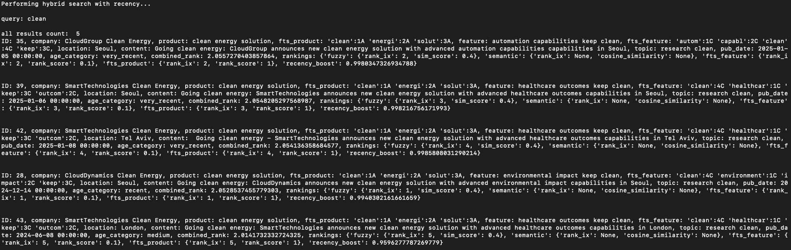

# Hybrid Search with Recency
This repository offers a comprehensive setup for implementing a hybrid search system that emphasizes recency in search results. In many real-world scenarios, retrieving the most recent information is crucial, especially in dynamic domains like news, social media, or stock market data. This system is designed to balance relevance and freshness, ensuring that users receive the latest and most pertinent results.

The solution leverages PostgreSQL's pgvector extension, which allows for efficient handling of vector data within the database. By integrating vector search capabilities directly into PostgreSQL, this setup facilitates seamless interactions with vector databases


## Prerequisites
Before you begin, ensure you have the following installed:

- [Docker](https://docs.docker.com/get-started/get-docker/): To run the containers.
- Create .env file. You can copy .env.example as .env
- Embedding access:
  - AWS Bedrock or OpenAI API key for embedding generation.
  - Note: If you would like to use OpenAI API for embedding generation, copy api key to .env file.

## Setup

### Spin Up Containers

Start by spinning up the necessary containers. This will initialize a PostgreSQL database, a worker instance for running commands, and pgweb for visualizing data and running queries.

```sh
docker compose up -d
```

### Create Vector Extension

To enable vector operations in PostgreSQL, you need to create the vector extension. You have two options:

- **Option 1**: Run the following command to create the extension directly in the container.
  ```sh
  docker exec -it pg_container psql -U postgres -d vectordb -c "CREATE EXTENSION IF NOT EXISTS vector;"
  ```

- **Option 2**: Use pgweb to run the extension query.
  - Navigate to `http://localhost:8002/` and execute:
    ```sql
    CREATE EXTENSION IF NOT EXISTS vector;
    ```

### Ingest Data to PostgreSQL

Ingest your data into the PostgreSQL database using the provided Python script.

```sh
docker exec -t worker bash -c "python ./search/ingest-to-pg.py -r prod"
```

### Create Functions

First, count the number of functions in the public namespace to verify setup.

```sh
docker exec -t pg_container psql -U postgres -d vectordb -c "SELECT COUNT(*) FROM pg_proc WHERE pronamespace = 'public'::regnamespace;"
```

#### Copy SQL Files

Copy the SQL files for hybrid and combo retrieval functions into the PostgreSQL container.

```sh
docker cp ./search/hybrid-retrieval.sql pg_container:/home/hybrid-retrieval.sql && docker cp ./search/combo-retrieval.sql pg_container:/home/combo-retrieval.sql
```


#### Execute SQL Files

Run the SQL files to add the necessary functions for hybrid and combo retrieval.

Hybrid retrieval function

```sh
docker exec -t pg_container psql -U postgres -d vectordb -f /home/hybrid-retrieval.sql
```

Now, check count the number of functions in the public namespace to verify setup.

```sh
docker exec -t pg_container psql -U postgres -d vectordb -c "SELECT COUNT(*) FROM pg_proc WHERE pronamespace = 'public'::regnamespace;"
```

Combo retrieval function

```sh
docker exec -t pg_container psql -U postgres -d vectordb -f /home/combo-retrieval.sql
```


Optional: Check count the number of functions again in the public namespace to verify if function is added.

```sh
docker exec -t pg_container psql -U postgres -d vectordb -c "SELECT COUNT(*) FROM pg_proc WHERE pronamespace = 'public'::regnamespace;"
```


### Run Search

Execute the search script to perform queries.

```bash
docker exec -t worker bash -c "python ./search/search.py -c"
```

```sh
docker exec -t worker bash -c "python ./search/search.py -h"
```

### Reset

Remove all docker containers along with data ingested in postgres database

```sh
docker compose down --volumes
```

#### Compare results
1. Hybrid search result


2. Hybrid search with recency result 
Compared to the results above in hybrid search, the recency pulls up most recent results (see id 35).



#### Credits where it deserves
- [supabase](https://supabase.com/docs/guides/ai/hybrid-search)
- [anyblockers](https://anyblockers.com/posts/postgres-as-a-search-engine#table-with-four-legs)